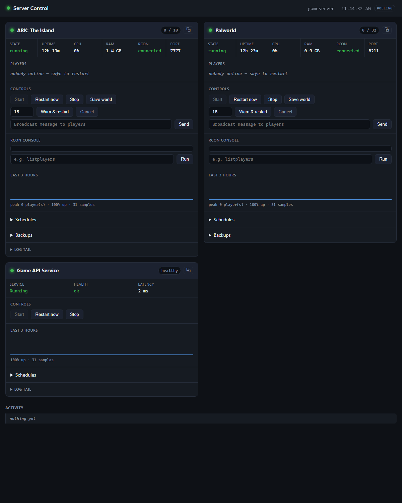
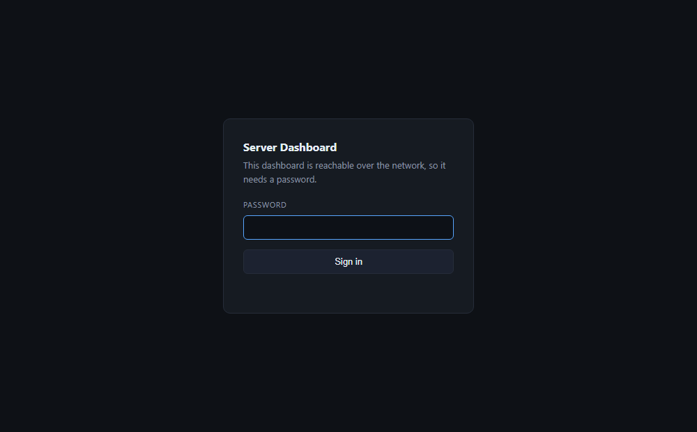

# Server Dashboard

A single-page control panel for the game servers and Windows services running on
one machine. Start, stop and restart them, see who's playing before you reboot on
top of someone, schedule nightly restarts, take world backups, and get told when
something crashes.

It runs on **Windows**, needs **Node 20+**, and has **one dependency** (Express).



**Supported out of the box:** ARK: Survival Ascended, Palworld, Minecraft (Java),
7 Days to Die, any Source-engine game, Valheim, plus any Windows service and any
process at all. [Adding your own game](docs/games.md) is one small file.

---

## Install

```bash
git clone https://github.com/YOUR-USERNAME/server-dashboard.git
cd server-dashboard
npm install
```

Then create your config:

```bash
copy config.example.json config.json
copy .env.example .env
```

Edit `config.json` for your servers and put the passwords in `.env`. Start it:

```bash
node server.js
```

Open <http://localhost:8770>.

`config.json` and `.env` are gitignored, so your passwords never end up in a
commit even if you fork this and push it back.

---

## Configuration

`config.json` is the whole configuration. Every string in it can reference an
environment variable with `${NAME}`, resolved from `.env` or the real
environment — which is how secrets stay out of the file:

```json
"rconPassword": "${ARK_RCON_PASSWORD}"
```

Use `${NAME:-fallback}` if you want a default. A `${NAME}` with no value and no
fallback is a startup error that names the exact setting, rather than a server
that quietly can't authenticate.

### Top level

| Key | Default | What it does |
|---|---|---|
| `port` | `8770` | Port to listen on |
| `bind` | `127.0.0.1` | Which interface to listen on. See [Access](#access) |
| `pollSeconds` | `10` | How often to check every target |
| `historyHours` | `48` | How much history to keep for the charts |
| `dataDir` | `data` | Where history, alerts and schedules are stored |
| `backupRoot` | `backups` | Where world archives go |
| `auth.password` | *(none)* | Required to bind anywhere but localhost |
| `auth.sessionDays` | `30` | How long a login lasts |
| `notifications` | off | Discord and webhook alerts — see below |
| `targets` | — | The servers to manage |

### A game target

```jsonc
{
  "id": "ark-island",            // unique, used in URLs
  "name": "ARK: The Island",     // shown on the card
  "kind": "game",
  "game": "ark",                 // which profile — see docs/games.md
  "host": "127.0.0.1",
  "gamePort": 7777,
  "rconPort": 27020,
  "rconPassword": "${ARK_RCON_PASSWORD}",
  "maxPlayers": 10,
  "processName": "ArkAscendedServer",   // no .exe
  "startCommand": "C:\\path\\to\\Start Island.bat",
  "logFile": "C:\\path\\to\\ShooterGame.log"
}
```

Most ports have sensible per-game defaults, so you can usually omit them. Omit
`startCommand` and the Start button disappears rather than failing.

> Windows paths in JSON need doubled backslashes (`C:\\Servers\\...`). Forward
> slashes (`C:/Servers/...`) also work.

### Watchdog — restart it when it crashes

```jsonc
"watchdog": {
  "enabled": true,
  "restartAfterSeconds": 60,   // grace period before acting
  "maxRestartsPerHour": 3      // then give up and say so
}
```

It waits out `restartAfterSeconds` so it doesn't fight you when you're
restarting something by hand, and it never triggers during a restart the
dashboard itself started. The hourly cap matters: a server that crashes *on
startup* would otherwise be restarted forever. When the cap is hit you get an
error alert telling you to fix the server instead.

### Backups

```jsonc
"backup": {
  "enabled": true,
  "paths": ["C:\\path\\to\\SavedArks"],
  "keep": 10,               // retention; oldest are pruned
  "beforeRestart": true     // archive on every restart, while it's stopped
}
```

The server is asked to save, given a moment to flush, and the files are then
staged with `robocopy` before being zipped — so a running server holding its
world open doesn't break the archive.

Hot backups of a *running* server use robocopy's backup mode, which needs the
Backup and Restore Files privilege. Run the dashboard elevated or as a service
and you have it; run it as a plain user and it falls back to a normal copy,
warns you once, and may skip files the server has open. `beforeRestart` backups
happen while the server is stopped, so they're always complete.

Restore is in the UI. It refuses unless the server is stopped and archives the
current world first, so a restore of the wrong file is recoverable.

### Schedules

```jsonc
"schedules": [
  { "cron": "0 5 * * *", "action": "restart", "warnMinutes": 15, "reason": "nightly restart" },
  { "cron": "0 */6 * * *", "action": "backup" }
]
```

Standard 5-field cron (`minute hour day month weekday`) on this machine's local
clock. Actions: `restart`, `start`, `stop`, `save`, `backup`, `broadcast`.
`warnMinutes` broadcasts a countdown to players at 15/10/5/1 minutes first, and
it's cancellable from the UI.

You can also add schedules in the browser — those are stored separately and can
be edited or deleted there. Ones declared in `config.json` show as read-only,
since the file is their source of truth.

If the dashboard is down when a job was due, it does **not** fire late on
startup. Waking up to a queue of missed 3am restarts is worse than missing them.

### Notifications

```jsonc
"notifications": {
  "windowsToast": true,
  "discord": {
    "enabled": true,
    "url": "${DISCORD_WEBHOOK_URL}",
    "events": ["error", "warn"]
  }
}
```

`webhook` takes the same shape and POSTs plain JSON to any URL. Identical
messages are suppressed for a minute and there's a hard ceiling of 10 per
minute, so a flapping server can't flood your channel.

### A Windows service target

```jsonc
{
  "id": "my-api",
  "name": "My API",
  "kind": "service",
  "serviceName": "MyApiService",
  "healthUrl": "http://127.0.0.1:3001/health",
  "nssm": "C:\\Apps\\nssm\\nssm.exe",   // optional, preferred for restarts
  "logDir": "C:\\Apps\\MyApi\\logs"     // newest file is tailed
}
```

---

## Access

**By default the dashboard listens on `127.0.0.1` and asks for no password.**
It's your machine; there's nobody to authenticate against.

**The moment you change `bind`, a password becomes mandatory.** Set
`bind: "0.0.0.0"` without `auth.password` and the dashboard refuses to start and
tells you why.

That's deliberate and not negotiable in config, because of what this thing is: a
web page that can stop, start and send arbitrary RCON commands to your servers.
Installed as a service it does that as `LocalSystem`. Unauthenticated on a LAN,
it's a remote-control handle for anyone on the network — including a guest phone
or a compromised smart TV.

To reach it from your phone:

```jsonc
"bind": "0.0.0.0",
"auth": { "password": "${DASHBOARD_PASSWORD}" }
```

and put `DASHBOARD_PASSWORD=something-long` in `.env`.



Even then, prefer a private network (Tailscale, WireGuard, a VPN) over
port-forwarding. The password is a solid second line of defence, not a licence to
put this on the public internet. If you do expose it, put it behind a reverse
proxy with TLS — the session cookie is marked `Secure` automatically when it sees
HTTPS.

Passwords are stored hashed with scrypt, sessions are HMAC-signed cookies, and
logins are rate-limited to 5 attempts per 15 minutes per IP.

---

## Running it in the background

Double-clicking `Start Dashboard.bat` works, but the window has to stay open.

To install as a Windows service, get [NSSM](https://nssm.cc/) and run
`Install Service.bat`. It starts at boot with no window and no UAC prompt.

Running as `LocalSystem` is what makes Start/Stop/Restart work on servers that
run elevated, and gives backups the privilege they want. One consequence: game
servers started *from the dashboard* run in session 0 and won't appear on your
desktop. They're headless anyway.

Without admin rights everything still **monitors** correctly — players, health,
charts, alerts — but the control buttons fail with "Access denied".

```bash
sc query ServerDashboard
```

`Uninstall Service.bat` removes it.

---

## What each card shows

| | |
|---|---|
| Status dot | green = healthy, amber = running but RCON/health failing, red = down |
| Stats | uptime, CPU, RAM, RCON state, port |
| Players | live names, or "nobody online — safe to restart" |
| Controls | Start / Restart / Stop / Save world |
| Warn & restart | broadcasts at 15/10/5/1 min, then restarts. Cancellable |
| Broadcast | send a message to everyone in-game |
| Console | raw RCON command box |
| Chart | 3h of player count; red bands are downtime |
| Schedules | recurring jobs for this server |
| Backups | run, download, restore |
| Log tail | last 200 lines |

Controls that a game can't support are hidden rather than shown and failing — a
Valheim card has no broadcast box, because Valheim has no way to send one.

Stop and Restart confirm first and warn if players are online. Both save the
world first and only force-kill if the server ignores the request.

The **⧉** button pops a card into its own window.

Updates arrive over a live event stream — the badge in the top bar reads `LIVE`.
If something between you and the dashboard breaks long-lived connections, it
falls back to polling on its own and the badge reads `POLLING`. Add `?live=0` to
the URL to force polling permanently.

---

## Docs

- [docs/games.md](docs/games.md) — supported games, per-game setup, and how to
  add your own
- [CONTRIBUTING.md](CONTRIBUTING.md)

## License

MIT — see [LICENSE](LICENSE).
